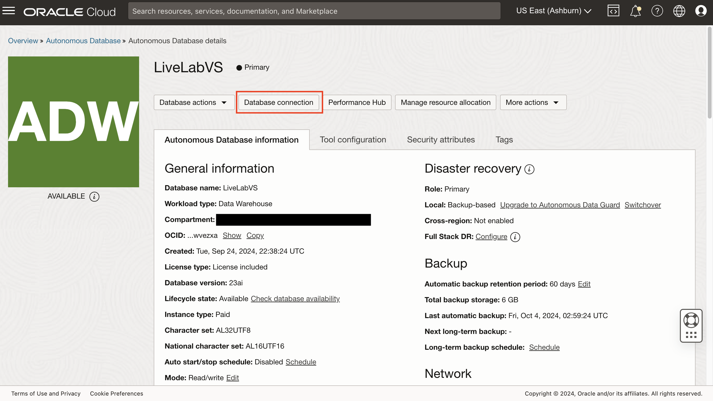
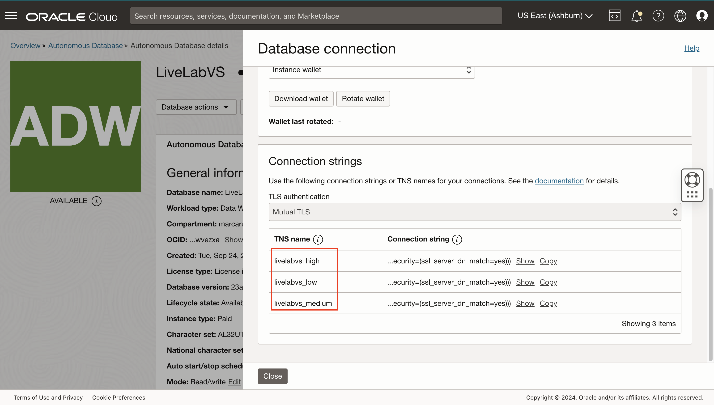
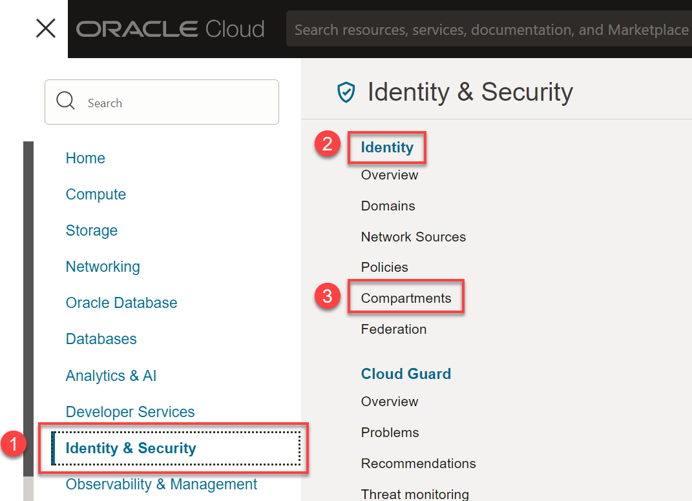
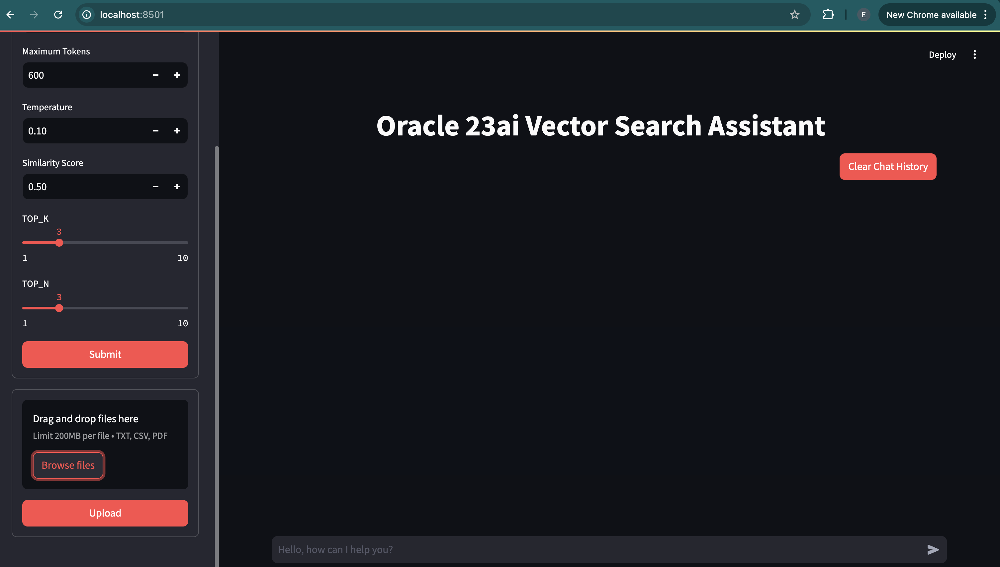
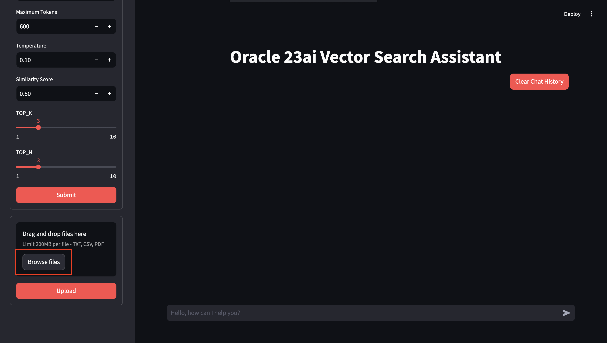
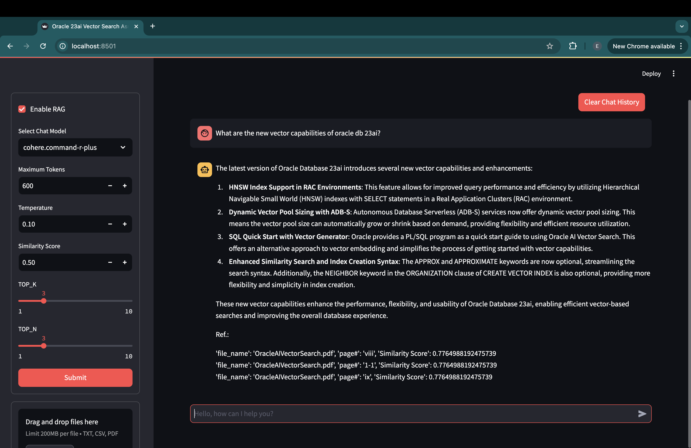
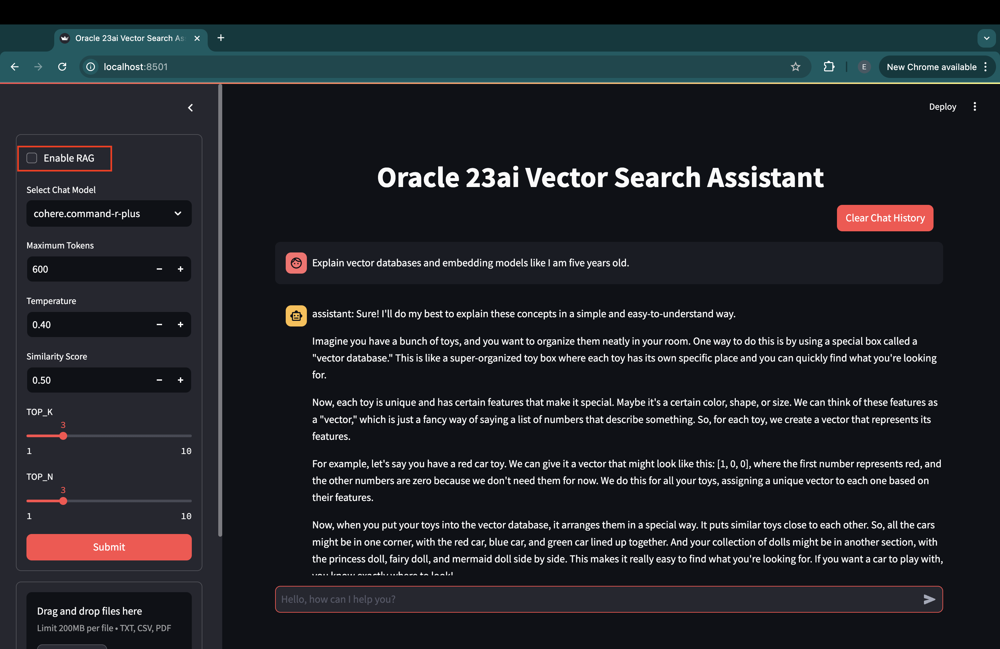

# Lab 4: Set up and Experiment with Streamlit Frontend

## Introduction

The final lab will cover setting up our front end, which is built on the open source Python package **Streamlit**. To orchastrate our RAG pipeline(refer to detailed explanation in Lab 3 for detailed overview) we will use **Llama-Index** to setup our LLM Chain and experiment with hyperparameters.

Estimated time: 30 Minutes

### Prerequisites
* Labs 1 and 2 of this Livelab completed.
* An environment authenticated with OCI API Keys: [docs](https://docs.oracle.com/en-us/iaas/Content/API/Concepts/sdk_authentication_methods.htm)

## Task 1: Update Config File(Database)

Assuming that you have gone through all the previous steps, you should now have all the infrastructure you need to run our application. One final thing we need to do before running the app is collect the paramaters that we need to run it:

1. Navigate to the **Autonomous Database** that we created on [Lab 1](../1-create-vector-db/create-vector-db.md).
    
2. Once you are in Autonomous Database details page, click **Database Connections**.
    
3. Scroll down to the bottom and copy one of the **service names**.
    
4. Navigate to your favorite code editor in the remote compute instance and fill out the DB details.
    

## Task 2: Update Config File(OCI Generative AI)

1. Click the hamburger menu, navigate to **Identity & Security** then **Compartments**.
    
2. Choose the compartment where you provisioned your ADB, Copy OCID of the Compartment.
3. Navigate back to config file and paste details in their respective fields.
    

## Task 3: (Optional) Obtain Cohere Reranker API Key

Reranker is an optional step on our pipeline, but one that can improve relevancy of results by putting it through another layer of evaulation. OCI does not currently have a Reranker as a service, but for testing purposes Cohere offers a Reranker API that we can use. To obtain a Cohere API key, please navigate to [Cohere Website](https://cohere.com).

## Task 4: Running RAG Front End

1. Navigate to your terminal window and make sure you are connected to the compute instance previously created in [Lab 2](..2-create-compute-instance/create-compute-instance.md)
2. Change directory into the code repository we have previously cloned in Lab 2.
3. Create a new directory called **wallet** and unzip the previously downloaded zip file in this directory.
4. Enter the following command to run the front end application.
<copy>
```streamlit run app.py```
</copy>
If you run into any issues in this portion of the lab, you can check error messages and detailed logging on your terminal.

## Task 5: Experimenting with RAG Frontend
1. After completing the previous task, navigate to ```http://localhost:8501``` on your browser.
     
2. Upload a file for processing. This may take some time depending on the size of your file. Supported file types are .txt, .pdf, .csv and .tsv. You can use the example file used in this lab [Oracle 23ai Vector Search User Guide](https://docs.oracle.com/en/database/oracle/oracle-database/23/vecse/oracle-ai-vector-search-users-guide.pdf).
     
3. Once the data is preprocessed and vector generation is finished, your RAG Agent is ready to chat with. Make your first query.
     
4. Evaluate results and pay attention to citations retrieved from document. These citations help us reference documents to ensure relevancy in results.
5. Optionally, disable RAG to ask model questions without context provided.
     
6. This RAG application allows for many customization options. Try adjusting the model, hyperparameters, minimum similarity score and more. To get more information on model hyperparameters visit [this](https://docs.oracle.com/en-us/iaas/Content/generative-ai/chat-models.htm#parameters-chat) link.
    
You may now **proceed to the next lab**.

## **Acknowledgements**

* **Authors** - Enis Aras
* **Code** - Enis Aras, PS Pathak
* **Last Updated By/Date** - Travis Ledbetter, October 2024
